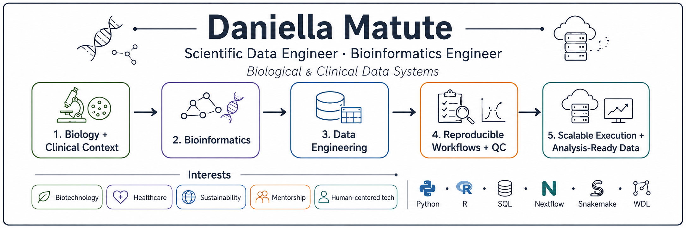

  

    Bio-based solutions, computational power, and 8 hours of sleep can change the world 🌱⚙️

---

## Who am I as a human
* I like to build Ikea Furniture
* I like some phylosophy, expecially "Absurdism" by Camus.
* I have lived in many countried, and plan to keep doing so.
* A rhino almost killed me once
* I am frustrated by my dependece on food, if I could photosynthesise I would be so happy. 
* I like to tinker, break, make, fix, add etc...

## What I work on

🧬 **Bioinformatics and genomics**

Microbial genomics, antimicrobial resistance, microbiome analysis, genome assembly, variant analysis, and clinical-genomic data integration

⚙️ **Scientific workflows**

Python, R, SQL, Nextflow, Snakemake, WDL, Docker, Terra.bio/GCP, and SLURM HPC

🧱 **Scientific data systems**

ETL pipelines, schema design, metadata harmonization, ontology reconciliation, provenance tracking, and analysis-ready datasets

🔍 **Data quality and reliability**

QC frameworks, validation logic, anomaly detection, batch-effect assessment, reproducibility, and tool-version tracking

🤖 **Applied AI and machine learning**

ML-ready biological datasets, experimental optimization, structured LLM workflows, human-in-the-loop systems, and scientific decision support

## Selected work

* **cAMRah:** A scalable WDL/Docker workflow for harmonized antimicrobial resistance gene prediction
* **Biological Data QC Framework:** Structured validation and ML-guided experimental decision support
* **16S Novelty Screening Pipeline:** Reproducible ASV analysis with conservative, auditable classification
* **Clinical-Genomic Data Harmonization:** Schema design, metadata mapping, provenance, and OMOP-aligned exploration
* **AI-Assisted Decision Platform:** FastAPI, structured LLM outputs, ETL, and human-in-the-loop review

## Connect

[LinkedIn](https://www.linkedin.com/in/dmatute/) 
